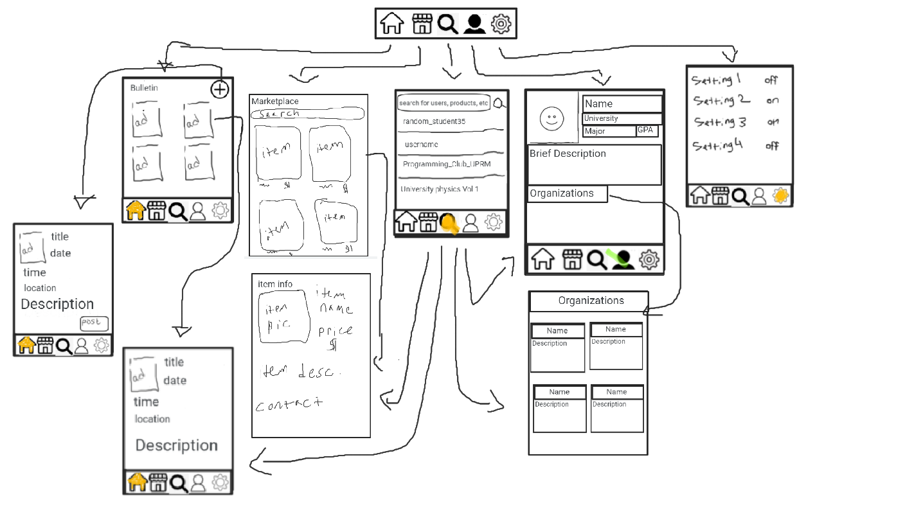
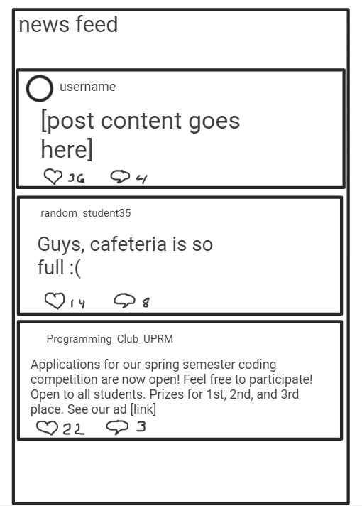
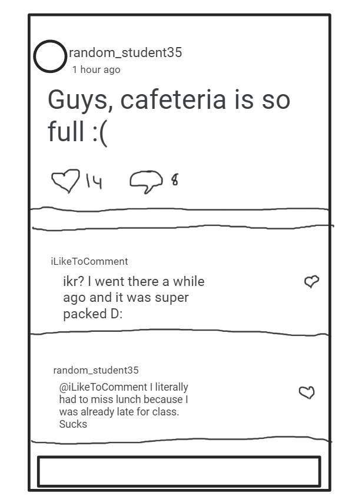
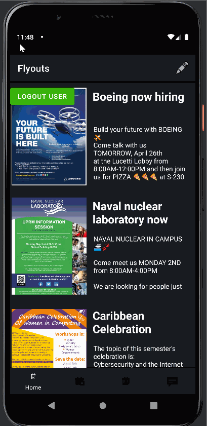

# Flyouts
Original app design project

## Table of Contents
1. [Overview](#Overview)
1. [Product Spec](#Product-Spec)
1. [Wireframes](#Wireframes)
2. [Schema](#Schema)
3. [Sprint 1 Progress](#Sprint-1-patch)
4. [Sprint 2 Progress](#Sprint-2-patch)
5. [Sprint 3 Progress](#Sprint-3-patch)
6. [Sprint 4 Progress](#Sprint-4-patch)

## Overview
### Description
A Marketplace/Newsletter/Social Media dedicated mainly for University students.

### App Evaluation
[Evaluation of your app across the following attributes]
- **Category:** Social Media/ Marketplace
- **Mobile:** It is a dedicated mobile app with focus on ease of use.
- **Story:** This app facilitates students social lives by keeping them up to date with whatever is going on in their campus, while also giving them the tools needed to help them sell their items(like used books or class materials), or buy some from other students.
- **Market:** College Students in their local campuses
- **Habit:** Users can check the app many times during the day for user posting, commenting, campus announcements and events, and marketplace.
- **Scope:** User generated content including text and pictures, plus user generated announcements and flyers for campus events and local student sales. Users can also comment on other user's posts, and give likes.

## Product Spec

### 1. User Stories (Required and Optional)

**Required Must-have Stories**

* - [x] User can login [completed]
* - [x] User can view a feed of flyers for local campus events. [first version implemented]
* - [x] User can announce their own in-campus events (compose).
* - [x] Users can see products for sale
* - [x] User can put products for sale (post)


**Optional Nice-to-have Stories**

* - [ ] User can follow other accounts
* - [x] User can make posts and see other user's posts
* - [ ] User can click other usernames in the app and go to their profiles
* - [ ] User can tap on a phone number on the marketplace and that will take them straight to the phone dialer.

### 2. Screen Archetypes

* Login
    * User can Login
* Register
* [list associated required story here]
* Stream
    * User can view a feed of product posts
* Detail
    * User can see additional info about the product or event
* Creation
    * User can post and announce their own events (UPRM related)
* Profile
    * User can follow other accounts
* Settings

### 3. Navigation

**Tab Navigation** (Tab to Screen)

* Home Feed
  -Bulletin Tab (For announcements and community advertisements)
  -News Feed Tab (For community posts)
* Marketplace
* Search
* Profile
* Settings


**Flow Navigation** (Screen to Screen)

* Login/Register
    * => Home Feed
* Home Feed
    * =>Creation
    * =>Home Feed (after creating post)
* Home Feed
    * =>Post detail (Either ad details if it's from bulletin and post comments if it's from news feed)
* Marketplace
    * =>Item details
* Search
    * none
* Profile
    * => Edit Profile screen
    * => Profile screen once finished editing
* Settings
    * => App settings screen
    * => Logout (if they press logout)

## Wireframes
Wireframe


### [BONUS] Digital Wireframes & Mockups
News Feed

Posts Comments


### [BONUS] Interactive Prototype

## Schema
[This section will be completed in Unit 9]
### Models
**Posts**
| Property      | Type          | Description |
| ------------- | ------------- | -------- |
| objectId         | String        | unique id for the user post |
| author          | pointer to user        | Name of the author |
| Image         | File       | Image the user posts|
| Caption         | string       | Image caption by author|
| CommentsCount         | Number       | number of comments|
| likesCount         | Number       | number of likes for the post|
| createdAt         | DateTime       | date when post was created|

**Flyers**
| Property      | Type          | Description |
| ------------- | ------------- | -------- |
| objectId         | String        | unique id for the user post |
| author          | pointer to user        | Name of the author |
| image         | File       | Image the user posts|
| createdAt         | DateTime       | date when post was created|
| title             | String |  Flyer title     |
| Description        | String        | description of the event|
| eventDate        | DateTime       | date of when the event will be hosted|

**Marketplace items/sales**
| Property      | Type          | Description |
| ------------- | ------------- | -------- |
| objectId         | String        | unique id for the user post |
| author          | pointer to user        | Name of the author |
| image         | File       | Image the user posts|
| itemDescription      | String        | description of the item|
| createdAt         | DateTime       | date when post was created|
| price     | Number       | price of the item in sale|
| condition     | String        | condition of the item|
| contactInfo    | String        | Information to contact the author |

**Groups**
| Property      | Type          | Description |
| ------------- | ------------- | -------- |
| objectId         | String        | unique id for the user post |
| OrgName        | String        | Name of the organization|
| OrgImage        | File       | Image the organization posts |
| OrgDescription        | String        | Description of the organization|
| memberCount        | Number       | Number of members in that organization|

**Profile**
| Property      | Type          | Description |
| ------------- | ------------- | -------- |
| objectID    | String | Unique ID for user profile |
| Name         | String        | name of user |
| University    | String         | user’s university  |
| Major      | String    | user’s major |
| bio         | String |   | user bio, block of text |
| profilePicture    | File | image uploaded by user as profile picture |
| Organizations/Groups | pointer | user’s organizations and groups |


### Networking
**Home**
* (Read/GET) Query all posts


```
        ParseQuery<Post> query = ParseQuery.getQuery(Post.class);
        query.findInBackground(new FindCallback<Post>() {
        public void done(List<Post> objects, ParseException e) {
	      if (e == null) {
     	    // done
	        } else {
   	      // Not done
	        }
        }
        });
```

* (Create/POST) Create a new like on a post

 ```
  ParseQuery<Post> query = ParseQuery.getQuery(Post.class);
 
// Retrieve the object by id
query.getInBackground(ObjectId, new GetCallback<Post>() {
 public void done(Post post, ParseException e) {
    if (e == null) {
 	 user.put("likes”, user.getLikes() + 1);
 	 user.saveInBackground().
    }
 }
});
```
* (Delete) Delete existing like

```
ParseQuery<Post> query = ParseQuery.getQuery(Post.class);
 
// Retrieve the object by id
query.getInBackground(ObjectId, new GetCallback<Post>() {
 public void done(Post post, ParseException e) {
    if (e == null) {
 	 user.put("likes”, user.getLikes() - 1);
 	 user.saveInBackground().
    }
 }
});
```

* (Create/POST) Create a new comment on a post

```
ParseQuery<Post> query = ParseQuery.getQuery(Post.class);
// Specify the object id
query.getInBackground("postObjectId”, new GetCallback<Post>() {
 public void done(Post post, ParseException e) {
    if (e == null) {
 	 // Access data using the `get` methods for the object
 	 Map<String, String> comments = post.getComments();
 	 // Do whatever you want with the data...
     	
 	 comments.put(“User”, comment);
  	post.put(“comments”, comments);
    } else {
 	 // something went wrong
    }
 }
});

```

* (Delete) Delete existing comment

```
ParseQuery<Post> query = ParseQuery.getQuery(Post.class);
// Specify the object id
query.getInBackground("postObjectId”, new GetCallback<Post>() {
 public void done(Post post, ParseException e) {
    if (e == null) {
 	 // Access data using the `get` methods for the object
 	 Map<String, String> comments = post.getComments();
 	 // Do whatever you want with the data...
     	
 	 comments.remove(“user”); //String name of user
  	post.put(“comments”, comments);
    } else {
 	 // something went wrong
    }
```

**Marketplace**
* (Read/GET) Query all products
```
ParseQuery<Product> query = ParseQuery.getQuery(Product.class);
query.findInBackground(new FindCallback<Product>() {
  public void done(List<Product> objects, ParseException e) {
	if (e == null) {
     	// done
	} else {
   	// Not done
	}
  }
});

```

**Search**
* (Read/GET) Query all users

```
ParseQuery<User> query = ParseQuery.getQuery(User.class);
query.findInBackground(new FindCallback<User>() {
  public void done(List<User> objects, ParseException e) {
	if (e == null) {
     	// done
	} else {
   	// Not done
	}
  }

  });
```

**Profile**
* (Read/GET) Query our user

```
ParseQuery<User> query = ParseQuery.getQuery(User.class);
 
query.getInBackground(userObjectId, new GetCallback<User>() {
 public void done(User user, ParseException e) {
    if (e == null) {
 	 String description = user.getDescription();
 	 String name = user.getName();
   int year = user.getYear();
   String mayor = user.getMayor();
 
 	 // manipulate the data.
    } else {
 	 // something went wrong
    }
 }
});

```

* (Update/PUT) Update profile info
```
ParseQuery<User> query = ParseQuery.getQuery(User.class);
 
// Retrieve the object by id
query.getInBackground(userObjectId, new GetCallback<User>() {
 public void done(User user, ParseException e) {
    if (e == null) {
 	 user.put("age", 21);
 	 user.put("Mayor", “INSO”);
 	 user.saveInBackground().
    }
 }
  });

```

- [OPTIONAL: List endpoints if using existing API such as Yelp]


## Sprint 1 patch
* User can register, login, logout and user session is persistent.
* User can view Flyers posted on the database.


## Sprint 2 patch
* Added detailed view to Bulletin Board Flyers
* Added Bottom Navigation Bar featuring buttons for Bulletin, Marketplace, and Profile
* Migrated the application to use Fragments along with the Bottom Navigation view
* Added a Create Flyer button on Bulletin Feed (currently a placeholder for the actual create activity. Users will later be able to upload Flyers and info to the feed)
* Added the Marketplace fragment to feature items for sale on campus. Currently read-only from the database.
* Fixed colors issue with login text boxes


## Sprint 3 patch
* Added flyer image view to Bulletin.
* Added Newsfeed with post composition (Twitter style)
* Added Flyer composition and posting to Bulletin.
* [Coming soon] Market place item posting composition.
* Minor visual upgrades




## Sprint 4 patch
* Added Market item posting
* Added profile fragment and the ability to see all newsfeed posts made under the logged in account.
* Moved the logout button to the profile fragment under a action menu item.
* Mayor UI theme and design overhaul to improve simplicity and visibility.


